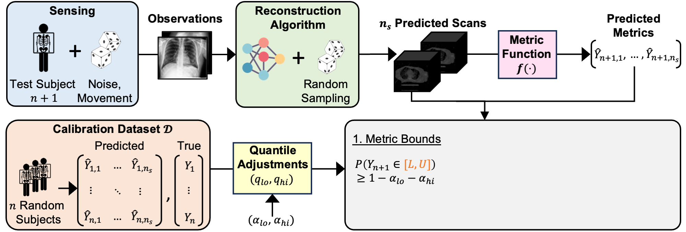

---
# Feel free to add content and custom Front Matter to this file.
# To modify the layout, see https://jekyllrb.com/docs/themes/#overriding-theme-defaults

layout: home
author_profile: true
---

<html>
  <head>
    <meta name="google-site-verification" content="ymJmG_J8zZOxI0rAZI361thPVXK4AqcdPoFBJFBd_1Y" />
  </head>
</html>

<h4>Announcements </h4>

----

April 24 2024: Our paper [Metric-guided Image Reconstruction Bounds via Conformal Prediction](https://arxiv.org/abs/2404.15274) is on arxiv!

July 14 2023: [wearablebp.github.io](https://wearablebp.github.io) is live! This website accompanies our timely review (publication soon). The goal of this website is to allow researchers to understand the state of Wearable BP.

May 5 2023: Defended M.S. thesis on [Wearable Blood Pressure Monitoring and Study Design](https://repository.rice.edu/items/dc23828a-80aa-41b9-95c9-554ddf6bea96)

Mar 25 2023: Appointed to the [National Library of Medicine (NLM) Training Program in Biomedical Informatics and Data Science](https://www.gulfcoastconsortia.org/home/training/bmi-nlm/#1556808353573-bb3f1459-2252)!

Nov 18 2020: Joined the [Rice Computational Imaging Lab](https://computationalimaging.rice.edu/)

Oct 27 2020: [Wearing a MASK: Compressed Representations of Variable-Length Sequences Using Recurrent Neural Tangent Kernels](https://arxiv.org/pdf/2010.13975.pdf)
