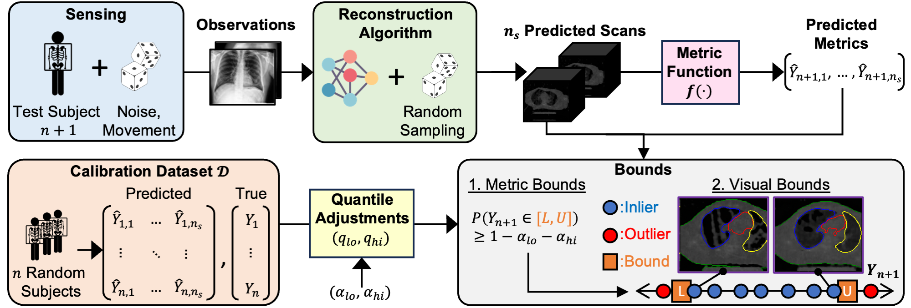

---
# Feel free to add content and custom Front Matter to this file.
# To modify the layout, see https://jekyllrb.com/docs/themes/#overriding-theme-defaults

layout: home
author_profile: true
---

<html>
  <head>
    <meta name="google-site-verification" content="ymJmG_J8zZOxI0rAZI361thPVXK4AqcdPoFBJFBd_1Y" />
  </head>
</html>

<h4>Announcements </h4>

----

Mar 4 2025: Our paper [Metric-guided Conformal Bounds for Probabilistic Image Reconstruction](https://arxiv.org/abs/2404.15274) is on arxiv.

Jan 2 2025: Our paper [When are Diffusion Priors Helpful in Sparse Reconstruction? A Study With Sparse-View CT](./assets/halluphase_downstream_ct.pdf) has been accepted at IEEE ISBI 2025.

Oct 16 2024: Collaborative follow-up work on developing an ultra-sound based non-invasive intracranial pressure monitoring device "An Ultrasonic Transceiver for Non-Invasive Intracranial Pressure Sensing" has been accepted at IEEE Transactions on Biomedical Circuits and Systems.

Oct 7 2024: Our paper [Regression Conformal Prediction under Bias](https://arxiv.org/abs/2410.05263) is available on arxiv.

Jul 18 2024: After several years of dedicated work, our paper [Wearable Blood Pressure Monitoring Devices: Understanding Heterogeneity in Design and Evaluation](https://ieeexplore.ieee.org/document/10623798) is accepted and available on IEEE transactions on Biomedical Engineering.

Mar 13 2024: Collaborative work on developing an ultra-sound based non-invasive intracranial pressure monitoring device "17.11 A 9mW Ultrasonic Through Transmission Transceiver for Non-Invasive Intracranial Pressure Sensing" was accepted at IEEE International Solid-State Circuits Conference.

Jul 14 2023: [wearablebp.github.io](https://wearablebp.github.io) is live! This website accompanies our timely review at IEEE transactions on Biomedical Engineering. The goal of this website is to allow researchers to understand the state of Wearable BP.

May 5 2023: Defended M.S. thesis on [Wearable Blood Pressure Monitoring and Study Design](https://repository.rice.edu/items/dc23828a-80aa-41b9-95c9-554ddf6bea96)

Mar 25 2023: Appointed to the [National Library of Medicine (NLM) Training Program in Biomedical Informatics and Data Science](https://www.gulfcoastconsortia.org/home/training/bmi-nlm/#1556808353573-bb3f1459-2252).

Oct 27 2020: [Wearing a MASK: Compressed Representations of Variable-Length Sequences Using Recurrent Neural Tangent Kernels](https://arxiv.org/pdf/2010.13975.pdf) has been accepted at ICASSP 2021.
